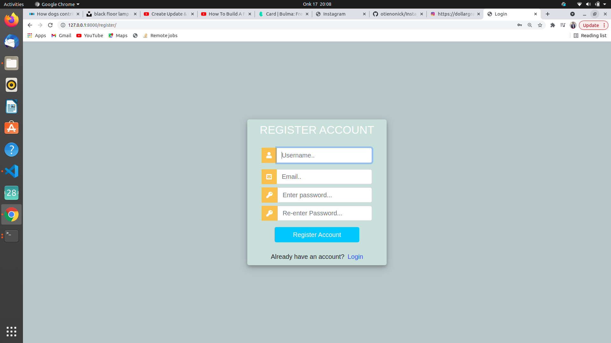
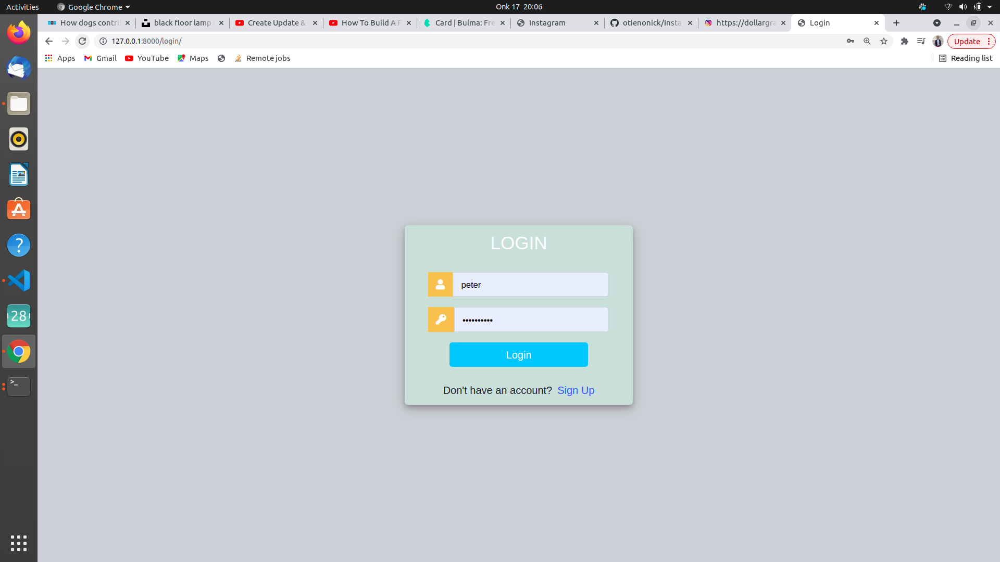
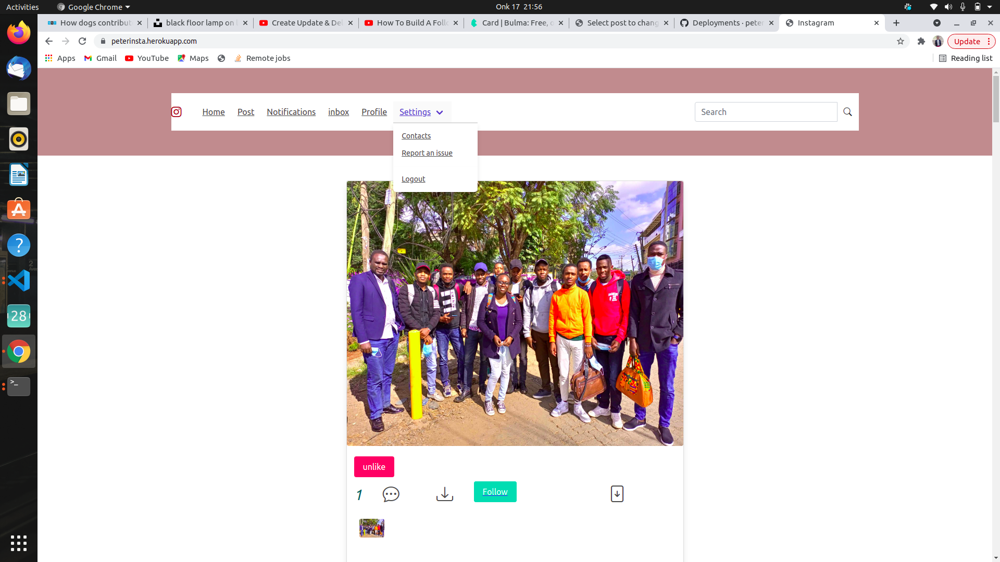
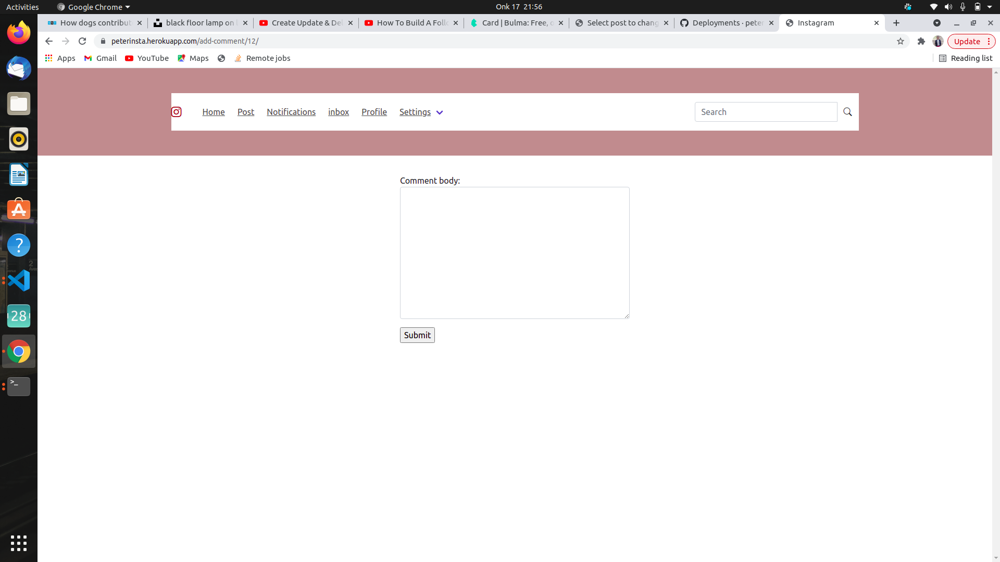

# Instagram clone

## Date, 17/10/2021

## By Peter Chege Wairimu.

# Description 

Instagram clone is an app where a user can add images comment on othere peoples images and coments and live a like

# Instructions

(i). Register in the sign up page inoder to have access in the account

(ii). Login and see your profile update it if you want

(iii). live a like and a comment

# Technologies Used

### (1).HTML.

### (2).Css.

### (3).Bootstrap.

### (4). Javascript.

### (5). Python/Django.

## 

# Support and contact details
Incase of any queries or any clarification you can contact me via email or phone.

### email. chegewairimu66@gmail.com

### phone. 0707569387

# License

License permission is hereby granted ,free of charge to anyone obtaining a copy of these software and associated documentation to deal in the software without restrictions including without limitation the rights to use ,copy modify ,publish and distribute copies of these software and to permit persons to whom the software is furnished to do so,subject to the following conditions:

The above copyright notice should be included.

## Copyright (c) 2021